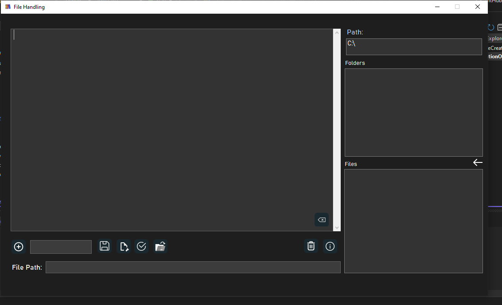

# 📁 File Handler - A Better Way to Manage Your Files 📁

I’ve developed **File Handler**, a Windows application built with the .NET Framework and C#, to simplify file management. This app allows users to easily:
- Read, write, create, update, and delete files and folders from one place.

<br>



## Features

### FileHandler_Load
This method is executed when the form loads. It retrieves all the available drives on the system and populates the drivers dropdown list with them.


```csharp
private void FileHandler_Load(object sender, EventArgs e)
{
    // Fetch all drives from the system
    foreach (DriveInfo dir in DriveInfo.GetDrives())
    {
        drivers.Items.Add(dir);
    }
}
```

### button1_Click (Append Text to File)

This method appends the text from textBox1 to a file at the specified path. It then
clears the text box after writing to the file.


```csharp
private void button1_Click(object sender, EventArgs e)
{
    StreamWriter write = new StreamWriter(path.Text, append: true);
    write.WriteLine(textBox1.Text);
    textBox1.Text = "";
    write.Flush();
    write.Close();
}
```

